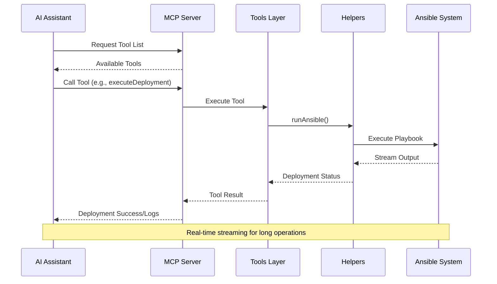
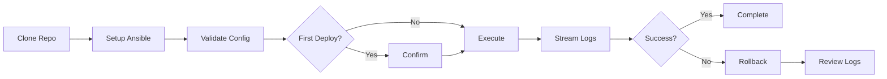

# 🏗️ MCP-Ansible-Drupal Architecture

## 📁 Directory Structure

```
MCP-Ansible-Drupal/
│
├── 📄 Configuration Files
│   ├── package.json              # NPM package configuration & dependencies
│   ├── tsconfig.json             # TypeScript compiler configuration
│   ├── webpack.config.js         # Webpack bundling configuration
│   ├── LICENSE                   # MIT License
│   └── README.md                 # Project documentation
│
├── 📂 src/                       # Source code directory
│   │
│   ├── 🎯 server.ts              # Main MCP server entry point
│   │                             # - Registers tools, prompts, resources
│   │                             # - Handles MCP protocol communication
│   │                             # - Manages tool execution lifecycle
│   │
│   ├── 🛠️ tools/                 # MCP Tool Implementations
│   │   ├── index.ts              # Exports all tools
│   │   │
│   │   ├── 🔧 Repository Management
│   │   │   └── cloneRepositoryTool.ts         # Clone DrupAnsible repo
│   │   │
│   │   ├── 🚀 Deployment Tools
│   │   │   ├── ansibleSetupTool.ts            # Initialize Ansible deployment
│   │   │   ├── executeDeployment.ts           # Run deployment playbooks
│   │   │   ├── validateDeployTool.ts          # Validate deployment config
│   │   │   └── validateDeployConfig.ts        # Configuration validation logic
│   │   │
│   │   ├── 🔐 Vault Security Tools
│   │   │   ├── VaultToolBase.ts               # Base class for vault operations
│   │   │   ├── encryptVaultTool.ts            # Encrypt vault files
│   │   │   ├── decryptVaultTool.ts            # Decrypt vault files
│   │   │   └── verifyVaultFile.ts             # Verify vault file integrity
│   │   │
│   │   ├── 📊 Monitoring & Logs
│   │   │   ├── getDeploymentLogs.ts           # Retrieve deployment logs
│   │   │   └── generateSkipTags.ts            # Generate skip tags for playbooks
│   │   │
│   │   ├── 🧹 Maintenance
│   │   │   └── ansibleCleanUpTool.ts          # Clean up deployment artifacts
│   │   │
│   │   └── 🔍 Utilities
│   │       └── resolveProjectPaths.ts         # Path resolution helpers
│   │
│   ├── 💬 prompts/               # MCP Prompt Templates
│   │   ├── index.ts              # Exports all prompts
│   │   ├── ansibleSetupPrompt.ts # Guided setup prompt
│   │   └── cloneRepositoryPrompt.ts # Repository clone prompt
│   │
│   ├── 🔧 helpers/               # Utility Functions
│   │   ├── index.ts              # Exports all helpers
│   │   ├── runAnsible.ts         # Execute Ansible playbooks
│   │   └── confirmFirstDeployment.ts # First deployment confirmation
│   │
│   └── 📝 types/                 # TypeScript Type Definitions
│       ├── index.ts              # Exports all types
│       └── types.ts              # Core type definitions
│
├── 📂 private/                   # Private configuration files
│   └── [User-specific configs]   # Vault files, credentials, etc.
│
├── 📂 tmp/                       # Temporary files
│   └── README.npm.md             # NPM readme template
│
└── 📂 dist/                      # Compiled output (generated)
    └── server.js                 # Bundled JavaScript
```

---

## 🎨 Component Architecture Diagram

```mermaid
graph TB
    subgraph "MCP Protocol Layer"
        Client[AI Assistant/Client]
    end

    subgraph "Server Core"
        Server[server.ts<br/>MCP Server Instance]
    end

    subgraph "Tool Layer"
        direction TB
        
        subgraph "Repository"
            CloneTool[cloneRepositoryTool]
        end
        
        subgraph "Deployment"
            SetupTool[ansibleSetupTool]
            ExecTool[executeDeployment]
            ValidateTool[validateDeployTool]
        end
        
        subgraph "Security"
            VaultBase[VaultToolBase]
            EncryptTool[encryptVaultTool]
            DecryptTool[decryptVaultTool]
        end
        
        subgraph "Monitoring"
            LogsTool[getDeploymentLogs]
            SkipTags[generateSkipTags]
        end
        
        subgraph "Maintenance"
            CleanupTool[ansibleCleanUpTool]
        end
    end

    subgraph "Helper Layer"
        RunAnsible[runAnsible]
        ConfirmDeploy[confirmFirstDeployment]
        ResolvePaths[resolveProjectPaths]
    end

    subgraph "Prompt Layer"
        SetupPrompt[ansibleSetupPrompt]
        ClonePrompt[cloneRepositoryPrompt]
    end

    subgraph "Type System"
        Types[types.ts<br/>Type Definitions]
    end

    subgraph "External Systems"
        Git[Git Repository<br/>DrupAnsible]
        Ansible[Ansible<br/>Playbooks]
        Vault[Ansible Vault<br/>Encrypted Files]
    end

    Client <-->|MCP Protocol| Server
    Server -->|Register & Execute| Tool Layer
    Server -->|Provide| Prompt Layer
    
    Tool Layer -->|Uses| Helper Layer
    Tool Layer -.->|Type Safety| Types
    Helper Layer -.->|Type Safety| Types
    Prompt Layer -.->|Type Safety| Types
    
    CloneTool -->|Clone| Git
    SetupTool -->|Initialize| Ansible
    ExecTool -->|Run| Ansible
    EncryptTool -->|Encrypt| Vault
    DecryptTool -->|Decrypt| Vault
    
    SetupTool -->|Uses| RunAnsible
    ExecTool -->|Uses| RunAnsible
    ExecTool -->|Uses| ConfirmDeploy
    
    EncryptTool -.->|Extends| VaultBase
    DecryptTool -.->|Extends| VaultBase
    
    style Server fill:#4A90E2
    style Tool Layer fill:#50C878
    style Helper Layer fill:#FFB347
    style Prompt Layer fill:#DDA0DD
    style Types fill:#F0E68C
    style External Systems fill:#FF6B6B
```

---

## 🔄 Data Flow Architecture



---

## 🧩 Key Components

### 1. **Server Core** (`server.ts`)
- Initializes MCP server instance
- Registers all tools and prompts
- Handles protocol communication
- Routes tool execution requests

### 2. **Tools Layer** (`tools/`)
- **Repository Management**: Clone and setup DrupAnsible
- **Deployment Tools**: Execute and validate deployments
- **Vault Security**: Encrypt/decrypt sensitive files
- **Monitoring**: Access deployment logs
- **Maintenance**: Cleanup operations

### 3. **Helpers Layer** (`helpers/`)
- `runAnsible`: Core Ansible execution logic
- `confirmFirstDeployment`: User confirmation workflow
- Path resolution and utility functions

### 4. **Prompts Layer** (`prompts/`)
- Guided setup interactions
- Repository cloning workflows
- Natural language templates

### 5. **Type System** (`types/`)
- TypeScript interfaces and types
- Ensures type safety across all layers
- Defines tool arguments and responses

---

## 🔐 Security Architecture

```
┌─────────────────────────────────────────┐
│         Vault File Management           │
├─────────────────────────────────────────┤
│                                         │
│  ┌──────────┐         ┌──────────┐    │
│  │ Encrypt  │◄───────►│ Decrypt  │    │
│  └──────────┘         └──────────┘    │
│       │                     │          │
│       └──────────┬──────────┘          │
│                  ▼                      │
│          ┌──────────────┐              │
│          │ VaultToolBase│              │
│          └──────────────┘              │
│                  │                      │
│                  ▼                      │
│          ┌──────────────┐              │
│          │Ansible Vault │              │
│          └──────────────┘              │
│                                         │
│  private/                               │
│  ├── vault_staging.yml (encrypted)     │
│  └── vault_prod.yml (encrypted)        │
└─────────────────────────────────────────┘
```

---

## 📦 Build & Distribution

```
Source (src/)
    │
    ├── TypeScript Files (.ts)
    │
    ▼
┌──────────────┐
│  TypeScript  │
│   Compiler   │
└──────────────┘
    │
    ▼
┌──────────────┐
│   Webpack    │
│   Bundler    │
└──────────────┘
    │
    ▼
Compiled Output (dist/)
    │
    └── server.js (executable)
         │
         ▼
    NPM Package
    @webfer/mcp-ansible-drupal
```

---

## 🎯 Tool Categories

| Category | Tools | Purpose |
|----------|-------|---------|
| **Setup** | `cloneRepository`, `ansibleSetup` | Initialize deployment environment |
| **Deployment** | `executeDeployment`, `validateDeploy` | Run and validate deployments |
| **Security** | `encryptVault`, `decryptVault` | Manage encrypted configurations |
| **Monitoring** | `getDeploymentLogs` | Access deployment history |
| **Maintenance** | `ansibleCleanup` | Clean up artifacts |

---

## 🌊 Deployment Workflow



---

## 🚀 Integration Points

### External Dependencies
- **DrupAnsible**: Ansible playbooks for Drupal deployment
- **Ansible Vault**: Encryption for sensitive data
- **Git**: Repository management
- **Node.js**: Runtime environment

### MCP Protocol Integration
- **Tools**: Executable actions
- **Prompts**: Guided workflows
- **Resources**: Configuration templates
- **Streaming**: Real-time deployment feedback

---

## 📝 Notes

- All tools are registered dynamically at server startup
- TypeScript provides compile-time type safety
- Webpack bundles for single-file distribution
- Supports both staging and production environments
- Maintains last 3 deployment logs for troubleshooting
